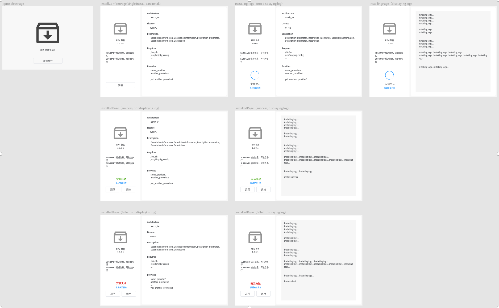
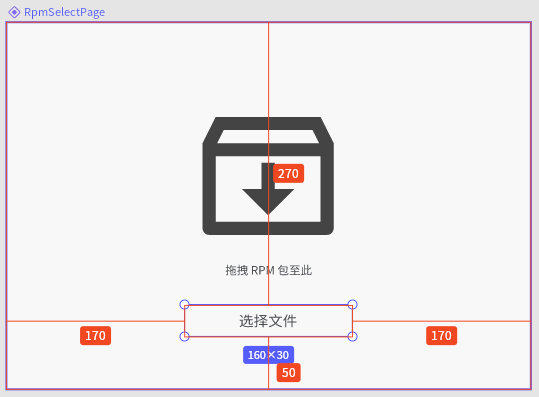
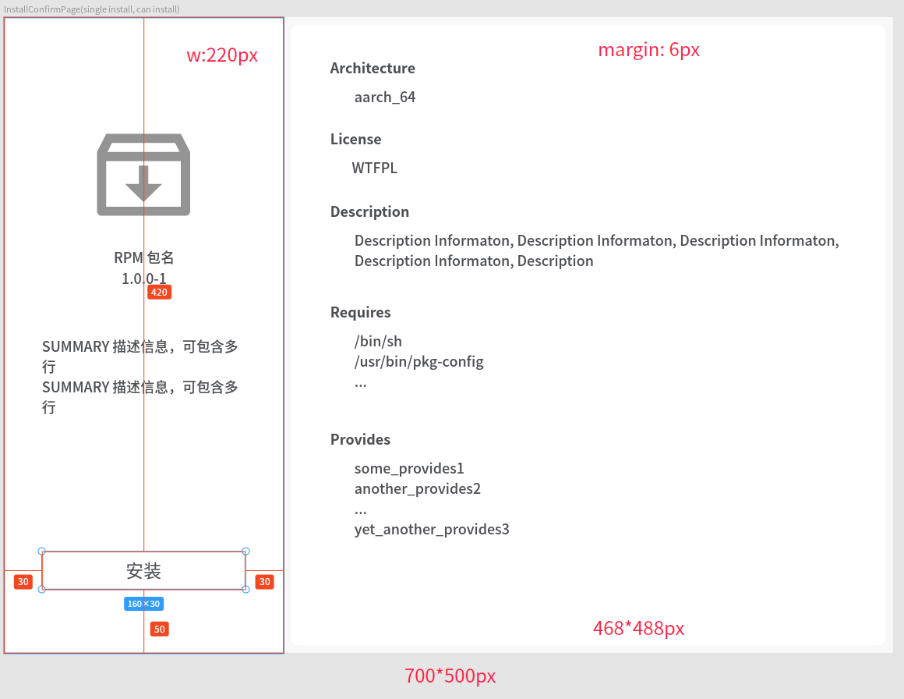
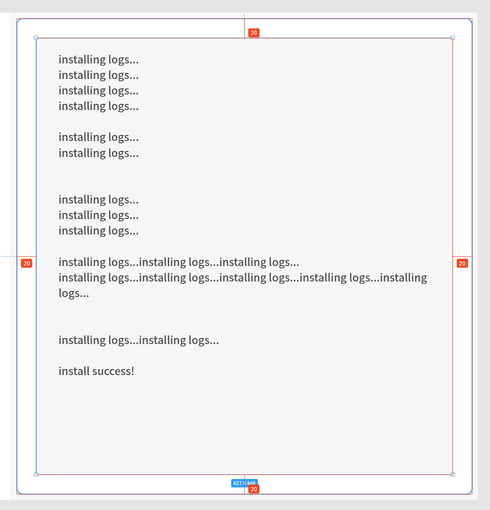
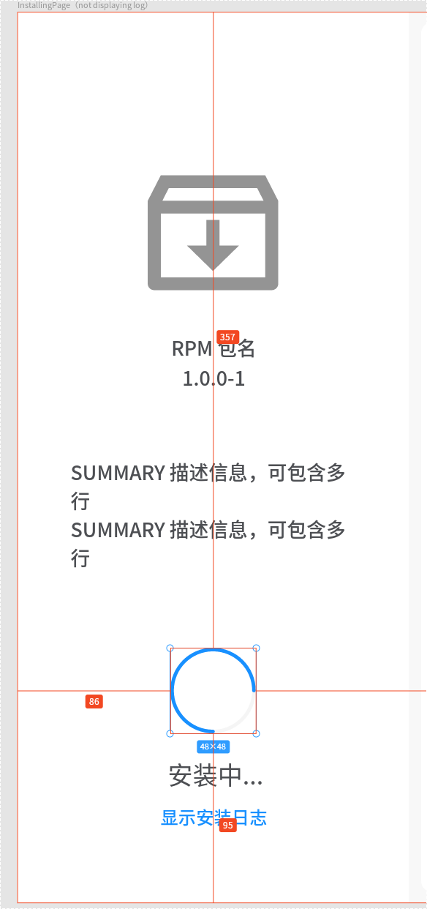
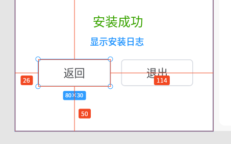

# deepin-rpm-installer

#### 介绍
Deepin rpm installer on openEuler

#### 正在开发中的全新界面设计



**RpmSelectPage**

```
size: 500px*350px
background-color: #F8F8F8
文本字号 11 ，距按钮 28px ，#4D4F53
```




**InstallConfirmPage**



除按钮外，所有字体均为 11 号，右侧小标题为 Bold ，其他均为 Regular

右侧圆角矩形背景的圆角半径 6px

日志文本框：






**InstalledPage**



安装成功 14号，`#39A300`；显示安装日志 10 号，`#1890FF`

安装失败 14号，`#DA0000`


#### 软件架构
待补充


#### 安装教程
待补充

#### 使用说明
待补充

#### 参与贡献
请提 issue 或与其他贡献者邮件联系
